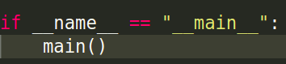

  
  

  
- Each test function must start with *test_*
- To check if function raises proper error:
  

### Setup and TearDown
- setUp is executed before every test_function.
- tearDown is executed after every test_function.
  

- For classes run before and after the whole TestCase.
- Useful for cases when retrieving from database.
-   

### Testing in-between the functions
- Mocking.